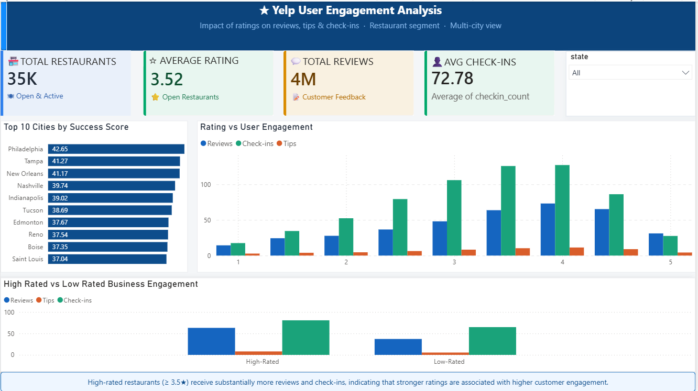

#  Restaurant Performance & Customer Engagement Analysis

## Project Overview

This project analyzes restaurant performance and customer engagement using the Yelp Open Dataset. The objective is to understand how restaurant ratings influence user engagement metrics such as reviews, check-ins, and tips.

The project uses SQL, Python, and Power BI to extract insights, identify engagement patterns, and build an interactive business dashboard.

---

## Business Problem

Restaurant businesses receive customer interactions through reviews, tips, and check-ins. Understanding how these engagement metrics relate to ratings can help businesses improve customer experience and increase visibility.

This project aims to answer:

- Do highly rated restaurants receive more engagement?
- How do reviews, tips, and check-ins vary across rating groups?
- Which cities have the most successful restaurants?
- How does engagement differ between high-rated and low-rated restaurants?

---

## Objectives

- Analyze the relationship between ratings and user engagement.
- Measure review, tip, and check-in activity across restaurants.
- Compare engagement between high-rated and low-rated restaurants.
- Identify top-performing cities based on business success.
- Build an interactive dashboard for business insights.

---

## Dataset

### Source

Yelp Open Dataset

### Tables Used

| Table | Description |
|---------|-------------|
| Business | Business details, ratings, location, and review counts |
| Review | Customer reviews and ratings |
| User | Yelp user activity information |
| Tip | Short customer comments and recommendations |
| Check-in | Customer visit activity |

### Dataset Summary

- Total Businesses: ~150,000
- Open Restaurant Businesses: ~52,000
- Review Sample Used: ~500,000 reviews
- Multiple cities across the United States and Canada
- Rating Scale: 1–5 stars

### Key Fields

#### Business Table
- business_id
- city
- state
- stars
- review_count
- is_open
- latitude
- longitude

#### Review Table
- review_id
- business_id
- user_id
- stars
- date

#### Tip Table
- business_id
- text
- date

#### Check-in Table
- business_id
- date

---

## Data Preparation

The Yelp JSON files were loaded into a SQLite database and processed using Python.

Data preparation included:

- Filtering restaurant businesses
- Removing closed businesses
- Handling missing values
- Aggregating check-ins and tips
- Creating engagement metrics
- Building success score indicators

---

## Tools & Technologies

### Programming & Analysis
- Python
- Pandas
- NumPy

### Database
- SQLite
- SQL

### Visualization
- Power BI

### Development Environment
- Jupyter Notebook
- VS Code
- GitHub

---

## Project Workflow

### 1. Database Creation
- Loaded Yelp JSON files
- Created SQLite database
- Stored business, review, tip, user, and check-in tables

### 2. Data Analysis
- Performed SQL queries
- Calculated engagement metrics
- Compared rating groups
- Identified city-level performance

### 3. Feature Engineering
Created:
- Success Score
- High-Rated vs Low-Rated Categories
- Engagement Metrics
- City Performance Indicators

### 4. Dashboard Development
Built an interactive Power BI dashboard to visualize insights and business trends.

---

## Dashboard KPIs

| KPI | Description |
|------|------------|
| Total Restaurants | Number of open restaurants analyzed |
| Average Rating | Average rating across restaurants |
| Total Reviews | Total customer reviews |
| Average Check-ins | Average customer engagement per restaurant |

---

## Key Insights

### High Ratings Drive Engagement

Restaurants rated 3.5★ and above generate significantly more reviews and check-ins compared to lower-rated restaurants.

### Engagement Increases with Ratings

Review counts and check-in activity generally increase as restaurant ratings improve.

### Check-ins Show Strong Customer Activity

Restaurants with higher ratings consistently receive more customer visits and engagement.

### Top Cities Perform Better

Cities such as Philadelphia, Tampa, and New Orleans achieved the highest success scores based on ratings and engagement metrics.

### Reviews and Check-ins are Positively Related

Businesses with stronger customer engagement tend to accumulate more reviews and visibility.

---

## Power BI Dashboard

### Features

- KPI Cards
- State Filter
- Top 10 Cities by Success Score
- Rating vs User Engagement Analysis
- High-Rated vs Low-Rated Comparison

---

### Dashboard Preview

## Business Recommendations

- Encourage customer reviews and check-ins.
- Focus on maintaining ratings above 3.5 stars.
- Monitor engagement metrics alongside ratings.
- Use city-level performance analysis for expansion decisions.

---

## Author

**Arshiya Roofi Shaik**
